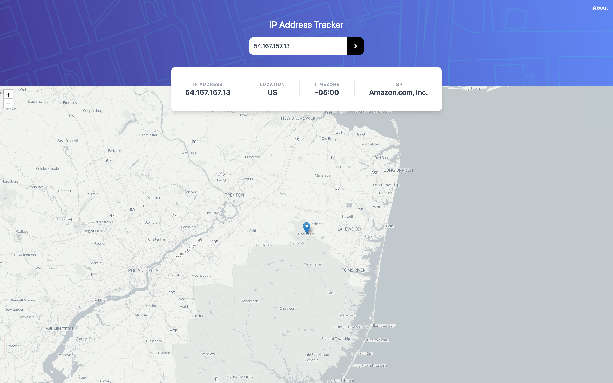

# IP Address Tracker

> Head over to [ip.davebitter.com](https://ip.davebitter.com) for a demo.

I build this IP Address Tracker as a demo project to show how you can build an interactive web application using [Remix](https://remix.run/docs). Head over to [About>Remix](https://ip.davebitter.com/about/remix) for more information on the framework itself.

I use this web application as part of a talk on the basics of Remix. Head over to [my website](https://davebitter.com) for an overview of the talks I give and/or shoot me a message at [daveybitter@gmail.com](mailto:daveybitter@gmail.com) if you are interested in me giving this talk at your event!

This application is a more extensive version of [this frontend challenge by frontendmentor.io](https://www.frontendmentor.io/challenges/ip-address-tracker-I8-0yYAH0/). The goal is to create a nicely designed web application that will make some calls to an API to retrieve information for a passed IP address and display an interactive map with the retrieved location.

## APIs
IP Address Tracker uses several APIs to retrieve data.
- [ipify API](https://www.ipify.org/) to retrieve the current user's IP as a good default
- [GeoIP API](https://geo.ipify.org) to retrieve information on submitted IP
- [leaflet-geosearch](https://github.com/smeijer/leaflet-geosearch) to retrieve information on location

## Getting started

### Run development environment
- `yarn dev` or `npm run dev` - starts the development environment with auto reloading and all that good stuff. Open [http://localhost:3000](http://localhost:3000) to view it in the browser.

- `yarn dev:netlify` or `npm run dev:netlify` - starts the development environment as it would be ran on Netlify. Open [http://localhost:3000](http://localhost:3000) to view it in the browser.

### Scripts
Besides these development scripts, there are many more scripts set up:

* `clean` - Cleans build folder
* `deploy:netlify` - Deploys to Netlify
* `postinstall` - Sets up Node
* `start` - Starts Remix server

### Tech stack
#### Remix
IP Address Tracker uses [Remix](https://remix.run/docs) to
* provide SSR [React.js](https://reactjs.org/). Pages are automatically optimised to deliver the best experience.
* handle routing
* generate builds
* and more

#### TypeScript
IP Address Tracker used [TypeScript](https://www.typescriptlang.org/) for static checking and documentation. You can view the Typescript config in [./tsconfig.json](./tsconfig.json).

#### Tailwind
IP Address Tracker used [Tailwind](https://tailwindcss.com/) to make it easy to implement the design for this challenge.

#### Netflify (CI/CD)
IP Address Tracker uses [Netlify](https://www.netlify.com/) (♥️) to build, deploy and optimise.
